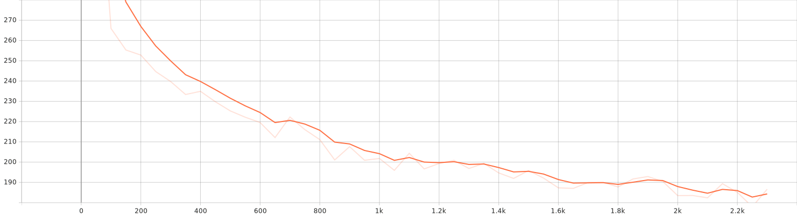
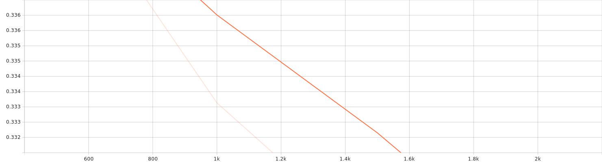
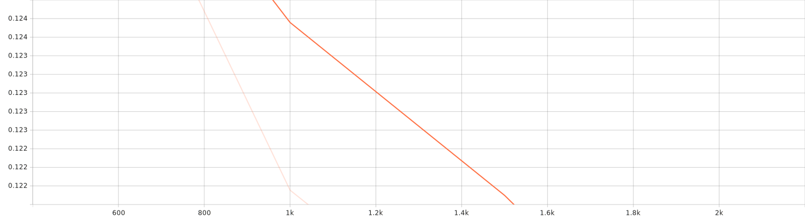

# ASR — End‑to‑End CTC Automatic Speech Recognition (Hugging Face + SageMaker)

Train, evaluate, export, and deploy ASR models using **Hugging Face Transformers** (e.g., Wav2Vec2 or Whisper‑CTC), the **datasets** library, and an opinionated data pipeline with robust audio loading and text normalization. Includes ready‑to‑use **AWS SageMaker** utilities for managed training, hyper‑parameter tuning, and real‑time inference endpoints.

> **Defaults**: `facebook/wav2vec2-base-960h` fine‑tuned on Common Voice 17.0 (English) with CTC decoding. You can swap any compatible CTC model / dataset via CLI flags.

---

## ✨ Highlights

- **CTC training pipeline** built on `transformers` with an explicit `DataCollatorCTCWithPadding` and metric reporting (WER).  
- **Datasets ingestion** via `datasets` (default: `mozilla-foundation/common_voice_17_0`, `en`, `sentence` column).  
- **Robust audio loading** that prefers FFmpeg on Windows, with safe fallback to `torchaudio`, `soundfile`, and `librosa`; faulty items are **skipped** without crashing.
- **Case‑aware normalization & whitelist filtering** derived from the tokenizer vocabulary to avoid OOV characters.
- **Optional waveform augmentations** (noise, level normalization) toggled by flags.
- **ONNX export** for lightweight, portable inference.
- **SageMaker utilities**: scripted **training**, **HPO**, **deployment**, and **auto‑scaling**. Inference handler supports JSON (`base64` audio) and raw `audio/wav` content types.

---

## 🗂️ Repository structure

```
ASR/
├─ requirements.txt
├─ src/
│  ├─ config.py                 # TrainConfig defaults (model, dataset, optimization, logging, etc.)
│  ├─ train.py                  # Main training script (local or SageMaker channels)
│  ├─ infer.py                  # Local transcription CLI
│  ├─ export_onnx.py            # Export a fine-tuned model to ONNX
│  ├─ evaluate_fn.py            # compute_metrics for Trainer (WER/CER helpers)
│  ├─ data/
│  │  ├─ datamodule.py          # Dataset loading, duration filter, robust decode, normalization, augmentation
│  │  └─ collator.py            # DataCollatorCTCWithPadding
│  ├─ models/
│  │  └─ modeling.py            # (Optional) model helpers/wrappers
│  └─ utils/
│     ├─ augment.py             # WaveformAugment & AugmentConfig
│     ├─ text_normalization.py  # Case-aware normalizers, whitelist filtering
│     ├─ metrics.py             # WER/CER utilities (uses jiwer)
│     ├─ log.py                 # logger
│     └─ seed.py                # reproducibility helpers
└─ sagemaker/
   ├─ train_estimator.py        # Launch SM PyTorch training jobs (spot support, S3 channels, env)
   ├─ hpo.py                    # HyperparameterTuner (eval_wer objective)
   ├─ deploy_endpoint.py        # Create real-time endpoint from model.tar.gz
   ├─ autoscale_endpoint.py     # Attach target-tracking autoscaling policy
   └─ serve/inference.py        # SM inference handler (model_fn/input_fn/predict_fn/output_fn)
```

> **Note**: On SageMaker, training **channels** and the output directory respect `SM_CHANNEL_*` and `SM_MODEL_DIR`. The local default output is `./outputs` unless overridden.

---

## ✅ Requirements

- **Python** 3.10+ (recommended)
- GPU with CUDA for training (optional but recommended). CPU works for small tests.
- **FFmpeg** installed/in‑PATH is recommended, especially on Windows.

Install Python deps:

```bash
python -m pip install -U pip
pip install -r requirements.txt
```

Install FFmpeg:
- **Linux**: `sudo apt-get update && sudo apt-get install -y ffmpeg`
- **macOS**: `brew install ffmpeg`
- **Windows**: install FFmpeg and ensure the binary is on `PATH`, or set `FFMPEG_BINARY`/`IMAGEIO_FFMPEG_EXE` env vars.

---

## 🚀 Quickstart (Local)

### 1) Train (defaults: Wav2Vec2 on Common Voice 17.0 English)

```bash
python src/train.py \
  --model_name facebook/wav2vec2-base-960h \
  --dataset_name mozilla-foundation/common_voice_17_0 \
  --dataset_config en \
  --text_column sentence \
  --train_split train \
  --eval_split validation \
  --max_duration 18 --min_duration 1 \
  --num_train_epochs 3 \
  --per_device_train_batch_size 16 \
  --per_device_eval_batch_size 16 \
  --gradient_accumulation_steps 8 \
  --learning_rate 3e-5 \
  --warmup_ratio 0.05 \
  --output_dir ./outputs/asr
```
**Download** the finetuned weights and tensorboard logs with bellow hyperparameter from [here](https://drive.google.com/file/d/1_ndR8_rxiocAao6OB0r1Sr3pth24USQq/view?usp=sharing)
## ⚙️ Training Configuration

| Category                  | Setting                                                               |
|---------------------------|-----------------------------------------------------------------------|
| **Model**                 | `facebook/wav2vec2-base-960h`                                         |
| **Dataset**               | Common Voice 17.0 (`en`), text column: `sentence`                     |
| **Duration**              | min: **1.0s**, max: **18.0s**                                         |
| **Epochs**                | **3**                                                                 |
| **Batch size**            | Train: **8** per device (×8 grad accumulation → effective **64**)     |
| **Learning rate**         | **3e-5**                                                              |
| **Optimizer**             | `adamw_torch_fused`                                                   |
| **Warmup ratio**          | 0.05                                                                  |
| **Weight decay**          | 0.0                                                                   |
| **Precision**             | FP16: ✅                                                               | BF16: ❌ | Gradient checkpointing: ❌                         |
| **Max grad norm**         | 1.0                                                                   |
| **Logging**               | every 50 steps                                                        |
| **Eval/Save**             | every 500 steps, keep last 2 checkpoints, early stopping patience = 3 |
| **Seed**                  | 42                                                                    |
| **Reports**               | TensorBoard                                                           |
| **# of training samples** | 50000(subset of Common Voice)                                         |
---

## 🖥️ Training Hardware & Environment

- **Device:** Laptop (Windows, WDDM driver model)
- **GPU:** NVIDIA GeForce **RTX 3080 Ti Laptop GPU** (16 GB VRAM)
- **Driver:** **576.52**
- **CUDA (driver):** **12.9**
- **PyTorch:** **2.8.0+cu129**
- **CUDA available:** ✅

---

## 📊 Training Logs & Metrics

- **Total FLOPs (training):** `10,814,747,992,293,114,000`
- **Training runtime:** `11,168.2969` seconds for 2,346 steps
- **Logging:** TensorBoard-compatible logs in `src/logs/training-logs/`

You can monitor training live with:

```bash
tensorboard --logdir src/output/logs
```

### 📉 Loss Curve
The following plot shows the training loss progression:



### 📉 Eval wer Curve

### 📉 Eval cer Curve

**Notes**

- If your dataset is gated, pass `--use_auth_token` (or login via `huggingface-cli login`).
- On Windows, the loader prefers FFmpeg for MP3; otherwise it falls back to `torchaudio/soundfile/librosa` automatically.
- The trainer prints **`eval_wer`** during evaluation. Lower is better. Checkpoints & final artifacts land in `--output_dir` (or `SM_MODEL_DIR` on SageMaker).

### 2) Transcribe locally

You can either use the provided CLI (if it accepts your use case) or a minimal Python snippet:

```bash
# Example CLI (check src/infer.py for exact flags)
python src/infer.py \
  --model_dir ./outputs/asr \
  --audio path/to/file.wav
```

**Python snippet**

```python
import torch, torchaudio
from transformers import AutoModelForCTC, AutoProcessor

model_dir = "./outputs/asr"  # HF hub id or local directory
device = "cuda" if torch.cuda.is_available() else "cpu"

processor = AutoProcessor.from_pretrained(model_dir)
model = AutoModelForCTC.from_pretrained(model_dir).to(device).eval()

wav, sr = torchaudio.load("path/to/file.wav")
if sr != processor.feature_extractor.sampling_rate:
    wav = torchaudio.functional.resample(wav, sr, processor.feature_extractor.sampling_rate)
inputs = processor(wav.squeeze(0).numpy(), sampling_rate=processor.feature_extractor.sampling_rate,
                   return_tensors="pt", padding=True)
with torch.no_grad():
    logits = model(**{k: v.to(device) for k, v in inputs.items()}).logits
pred_ids = torch.argmax(logits, dim=-1)
print(processor.batch_decode(pred_ids.cpu().numpy())[0])
```

---

## 🧪 Evaluation

- WER is computed during evaluation via `compute_metrics` (see `src/evaluate_fn.py` & utilities in `src/utils/metrics.py`).  
- You can control evaluation cadence via `--eval_steps` and logging via `--logging_steps` (see `src/config.py` defaults).

---

## 📦 Export to ONNX

Export a fine‑tuned model for lightweight deployment:

```bash
python src/export_onnx.py \
  --model_dir ./outputs/asr \
  --opset 17 \
  --output ./outputs/asr.onnx
```

> After export, run `onnxruntime` to test latency/throughput on CPU environments.

---

## ☁️ AWS SageMaker: Train → Deploy → Scale

These scripts reuse **`src/train.py`** and a simple **inference handler**. They assume you’ve staged your data on S3.

### 0) Prepare S3 layout

```
s3://<BUCKET>/asr/train/  # training data
s3://<BUCKET>/asr/eval/   # optional eval data
```

### 1) Launch a training job

```bash
python sagemaker/train_estimator.py \
  --role arn:aws:iam::<ACCOUNT>:role/<SageMakerExecutionRole> \
  --bucket <BUCKET> \
  --train_s3 s3://<BUCKET>/asr/train/ \
  --eval_s3  s3://<BUCKET>/asr/eval/ \
  --instance_type ml.g4dn.xlarge \
  --instance_count 1 \
  --use_spot
```

Artifacts are written to `s3://<BUCKET>/asr/output/<job>/`. The model artifact contains `code/requirements.txt` so the hosting container can install dependencies at deploy time.

### 2) Deploy a real‑time endpoint

```bash
python sagemaker/deploy_endpoint.py \
  --role arn:aws:iam::<ACCOUNT>:role/<SageMakerExecutionRole> \
  --model_data s3://<BUCKET>/asr/output/<job>/output/model.tar.gz \
  --instance_type ml.g4dn.xlarge \
  --endpoint_name my-asr-endpoint
```

### 3) Invoke the endpoint

- **JSON** (`application/json`) with base64 waveform (16 kHz assumed):

```bash
aws sagemaker-runtime invoke-endpoint \
  --endpoint-name my-asr-endpoint \
  --content-type application/json \
  --body '{"base64":"<BASE64_WAV>","sample_rate":16000}' \
  out.json && cat out.json
# => {"text": "... transcription ..."}
```

- **Raw WAV** (`audio/wav` or `audio/x-wav`) is also supported.


### 4) Attach autoscaling

```bash
python sagemaker/autoscale_endpoint.py \
  --endpoint_name my-asr-endpoint \
  --min_capacity 1 \
  --max_capacity 4 \
  --target_value 60.0
```

### 5) Hyper‑parameter tuning (HPO)

```bash
python sagemaker/hpo.py \
  --role arn:aws:iam::<ACCOUNT>:role/<SageMakerExecutionRole> \
  --bucket <BUCKET> \
  --train_s3 s3://<BUCKET>/asr/train/ \
  --eval_s3  s3://<BUCKET>/asr/eval/
```

This launches a tuner on `per_device_train_batch_size` and `learning_rate` optimizing **`eval_wer`**.


**Implementation details**

- Inference handler (`sagemaker/serve/inference.py`) implements the standard `model_fn`, `input_fn`, `predict_fn`, `output_fn` for PyTorchModel servers; it loads `AutoProcessor` + `AutoModelForCTC`.  
- Training uses `SM_CHANNEL_TRAIN` / `SM_CHANNEL_EVAL` if present; `--output_dir` defaults to `SM_MODEL_DIR` on SageMaker.

---

## 🔧 Configuration

All major knobs live in `src/config.py` (and are mirrored as CLI args in `src/train.py`):

- **Model & data**: `model_name`, `dataset_name`, `dataset_config`, `text_column`, `train_split`, `eval_split`, `cache_dir`, `output_dir`  
- **Audio constraints**: `min_duration`, `max_duration`  
- **Optimization**: `learning_rate`, `weight_decay`, `num_train_epochs`, `per_device_*_batch_size`, `gradient_accumulation_steps`, `warmup_ratio`, `max_grad_norm`  
- **Memory**: `fp16`, `bf16`, `gradient_checkpointing`, `freeze_feature_encoder`  
- **Logging**: `logging_steps`, `eval_steps`, `save_steps`, `save_total_limit`, `seed`  
- **Data processing**: `use_augmentations`, `noise_dir`, `num_proc`  
- **Decoding (optional)**: `lm_path` (KenLM), `beam_width`  

---

## 🧰 Tips & Troubleshooting

- **FFmpeg on Windows**: if MP3 decode errors occur, install FFmpeg and set `FFMPEG_BINARY` or `IMAGEIO_FFMPEG_EXE`. The pipeline will try FFmpeg → `torchaudio` → `soundfile` → `librosa` and skip bad files instead of failing the job.
- **OOM**: lower `--per_device_train_batch_size`, enable `--gradient_checkpointing`, or increase `--gradient_accumulation_steps`.
- **Tokenizer mismatch**: if normalized text becomes empty (e.g., casing in vocab), switch `model_name` to a matching tokenizer or adjust normalization flags.
- **Gated datasets/models**: pass `--use_auth_token` or log into Hugging Face.
- **Reproducibility**: set `--seed`, pin package versions in `requirements.txt` where needed.

---

## 📄 License

No license file is currently present. By default, that means **all rights reserved** by the repository owner. If you intend others to use this code, consider adding an open‑source license (e.g., MIT, Apache‑2.0).

---

## 🙏 Acknowledgements

- [Hugging Face Transformers](https://github.com/huggingface/transformers) & [datasets](https://github.com/huggingface/datasets)
- [jiwer](https://github.com/jitsi/jiwer) for WER/CER computation
- [ONNX / onnxruntime](https://onnx.ai/) for portable inference
- [AWS SageMaker](https://aws.amazon.com/sagemaker/) for managed training & hosting

---

## 📬 Questions

Please open an issue or reach out if you’d like recipe examples for other datasets (LibriSpeech, TED‑LIUM, Common Voice languages, AISHELL, …) or decoding with language models (pyctcdecode/KenLM).
